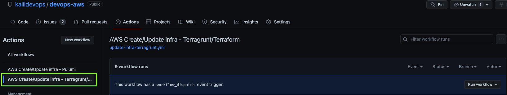
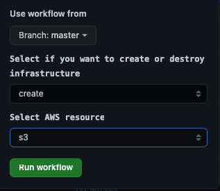

# devops-aws

## Description

This repo brings some examples of CICD and IaC for AWS.

Tools:

- Terraform
- Terragrunt
- Pulumi
- Github Actions

## Management of Infrastructure
### Terraform/Terragrunt
#### Option 1 - Github Actions workflows
The workflow [update-infra-terragrunt.yml](.github/workflows/update-infra-terragrunt.yml) provides the options to create/update or delete the infrastructure using Terragrunt/Terraform.

You can choose via browser if you want create/destroy a specific resource or all resources at the same time:

1) Select the workflow in Actions page:



2) Choose branch, the option to create or destroy and which resources:



#### Option 2 - local

From ``` iac/terragrunt/aws-default-account/dev/us-east-1 ``` directory, run the follow commands according your needs

Apply for all resources:

```
terragrunt run-all apply --terragrunt-non-interactive
```

Destroy all resources:

```
terragrunt run-all destroy --terragrunt-non-interactive
```

Create/Update specific resource:

```
terragrunt apply -auto-approve --terragrunt-working-dir <eks|s3|sns|...>
```

Destroy specific resource:

```
terragrunt destroy -auto-approve --terragrunt-working-dir <eks|s3|sns|...>
```

### Pulumi
#### Github Actions workflows
The workflow [update-infra-pulumi.yml](.github/workflows/update-infra-pulumi.yml) provides the options to create, update or delete the infrastructure using Pulumi (with Python).

You can choose via browser if you want to create, update or destroy a specific resource:

1) Select the workflow in Actions page:


2) Choose branch, the option to create or destroy and which resources:

